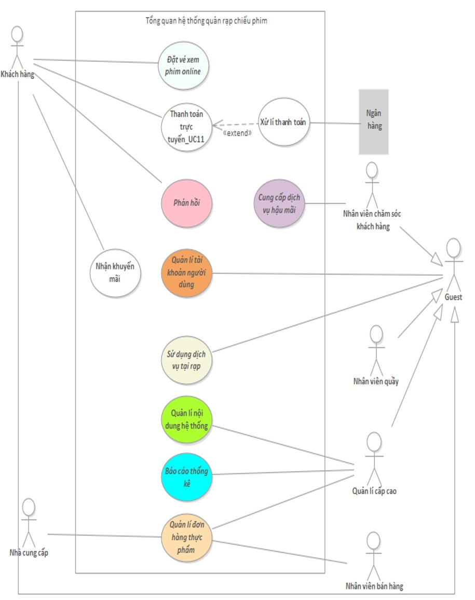
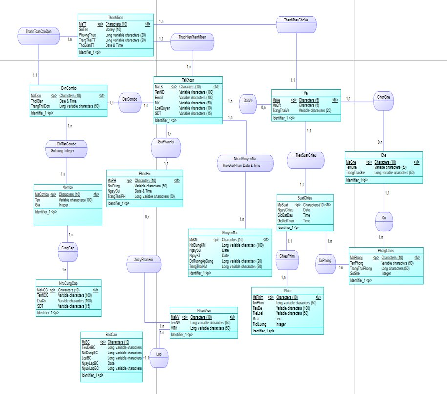
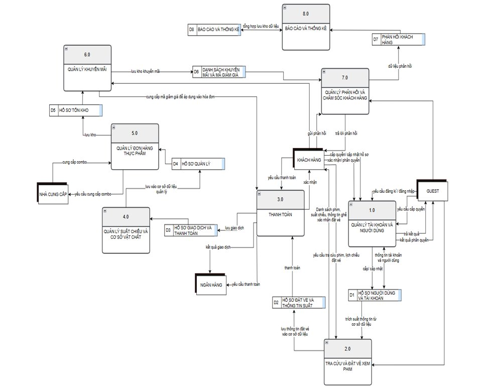
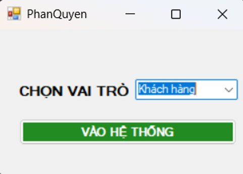
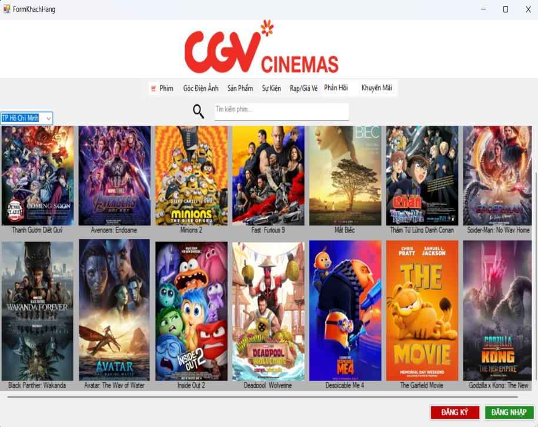
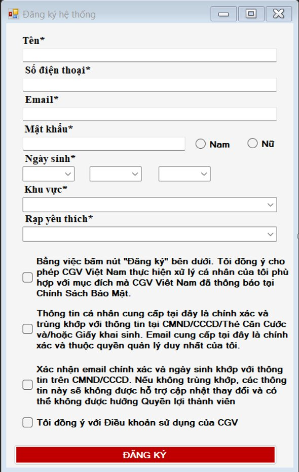
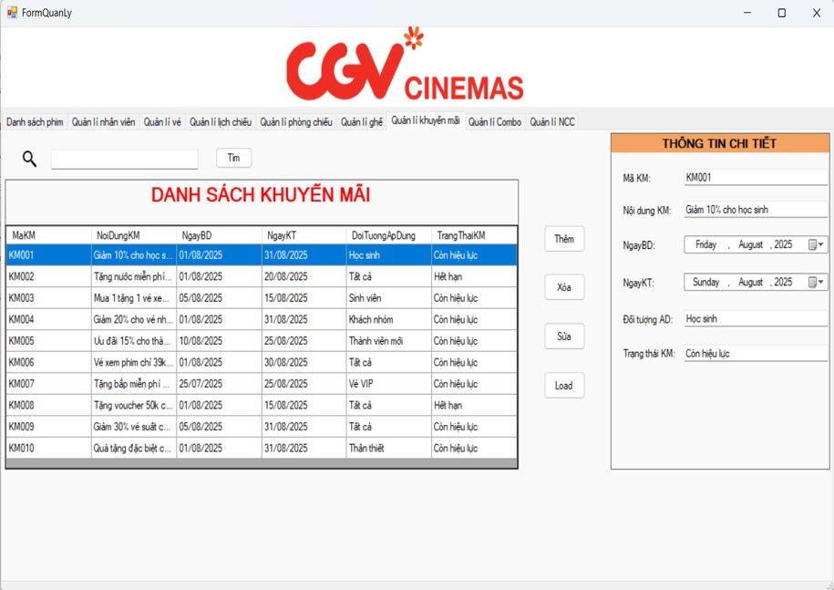

# CGV Cinema Management System (Academic Case Study)

   

> **Academic course project** — End-to-end analysis and design of a cinema management system for CGV Vietnam, covering business process modelling, database design, data flow diagrams, and a Windows Forms demonstration application across eight functional modules.

---

## Business Problem

Manual operations at CGV create data duplication, processing delays during peak periods such as public holidays and blockbuster releases, and a lack of integration between departments. This project designs a structured IT solution to digitalise and automate the full workflow — from ticket booking and payment to content management and reporting — across **eight core business modules**.

---

## Functional Scope

| Module | Key Capabilities |
|---|---|
| Account Management | Registration, login, 4-tier role management, OTP password recovery |
| Movie Search & Booking | Film search, showtime browsing, real-time seat selection, ticket cancellation |
| Payment Processing | Internet banking, e-wallets, invoice generation, promotion application |
| Showtime & Facilities | Film, screening room, and seat management; conflict-free schedule planning |
| Food & Beverage Orders | Combo catalogue, supplier stock intake, inventory management |
| Promotions | Discount code creation, issuance, and checkout-time redemption |
| Feedback & Customer Service | Complaint intake, staff assignment, status tracking |
| Reporting & Analytics | Ticket and combo revenue statistics, feedback analysis, Excel export |

---

## System Architecture

```
Presentation Layer   →  C# WinForms UI  (24 screens across 3 permission groups)
Business Logic Layer →  Workflow rules, integrity constraints, validation
Data Access Layer    →  SQL Server — stored procedures, triggers, constraints
```

---

## System Diagrams

**Use Case Diagram — System Overview**



**Entity Relationship Diagram (ERD)**



**Data Flow Diagram — Level 1**



---

## Database Design

14 tables, fully normalised to **3NF**. High-level entity relationships:

```
TAIKHOAN ──< VE >── SUATCHIEU ──< PHIM
    │                   └── TAIPHONG ──< PHONGCHIEU ──< GHE
    │
    ├──< THANHTOAN >── DONCOMBO ──< CHITIETCOMBO >── COMBO >── NHACUNGCAP
    ├──< PHANHOI >── NHANVIEN ──< BAOCAO
    └──< NHANKHUYENMAI >── KHUYENMAI
```

**Key business rules**

- Unpaid tickets are held for a maximum of **10 minutes** before automatic cancellation and seat release
- Showtimes in the same room must be separated by **at least 10 minutes** with no overlap
- Each QR ticket code is **single-use only** at the venue gate
- Customer feedback must be resolved **within 48 hours** of receipt

**Integrity constraints**

| Table | Attribute | Valid Domain |
|---|---|---|
| TAIKHOAN | LoaiQuyen | `Admin` · `NhanVien` · `KhachHang` |
| VE | TrangThaiVe | `DaDat` · `Huy` · `TamGiu` |
| GHE | TrangThai | `Trong` · `DaDat` · `BaoTri` |
| PHONGCHIEU | TrangThaiPhong | `HoatDong` · `BaoTri` · `NgungHoatDong` |
| PHIM | TrangThaiPhim | `DangChieu` · `SapChieu` · `NgungChieu` |
| SUATCHIEU | Time constraint | `EndTime > StartTime` |
| KHUYENMAI | Date constraint | `EndDate ≥ StartDate` |

---

## Use Case Summary

32 Use Cases fully specified with actors, preconditions, main and alternative flows, postconditions, and business rules.

| Group | Representative Use Cases |
|---|---|
| Account | UC01 Register · UC02 Login · UC03 Change Password · UC04 OTP Recovery |
| Booking | UC05 Search Film · UC06 View Showtimes · UC08 Book Ticket · UC09 Cancel Ticket |
| Transactions | UC10 Select Combo · UC11 Payment · UC12 Scan QR Code at Venue |
| Administration | UC17 Manage Films · UC21 Manage Showtimes · UC25 Revenue Statistics |
| Inventory | UC29 Create Combo · UC30 Manage Stock · UC31 Supplier Intake |

---

## Repository Structure

```
/src                          →  C# WinForms application source
/database
    QuanLyRapChieuPhim.sql    →  Full SQL schema, tables, constraints
/docs
    Report.docx               →  Full project report
    screenshots/              →  UI and diagram screenshots
README.md
```

---

## Screenshots

**System Diagrams**

| Role Selection | Customer Home |
|:---:|:---:|
|  |  |

| Registration Form | Promotion Management |
|:---:|:---:|
|  |  |

---

## Non-Functional Requirements

| Criterion | Requirement |
|---|---|
| Performance | Response time < 3 seconds · Supports ≥ 500 concurrent users |
| Security | Bcrypt/Argon2 hashing · HTTPS · Protection against SQL Injection, XSS, CSRF · Admin 2FA |
| Reliability | Uptime ≥ 99.9% · Automated backups · Disaster recovery plan |
| Portability | Responsive design · Docker-ready · Windows / Linux / Cloud |
| Legal compliance | Vietnamese Cybersecurity Law 2018 · Decree 119/2018 on e-invoicing |

---

## Project Info

| | |
|---|---|
| **Student** | Nguyen Ngoc Xuan Nghi — Student ID 2321004036 |
| **Course** | Systems Analysis & Design — Class 2521101164305 |
| **Supervisor** | ThS. Le Thi Kim Thoa |
| **Institution** | University of Finance – Marketing · Faculty of Data Science |
| **Completed** | August 2025 |

> *The CGV brand name is used solely for academic purposes.*
